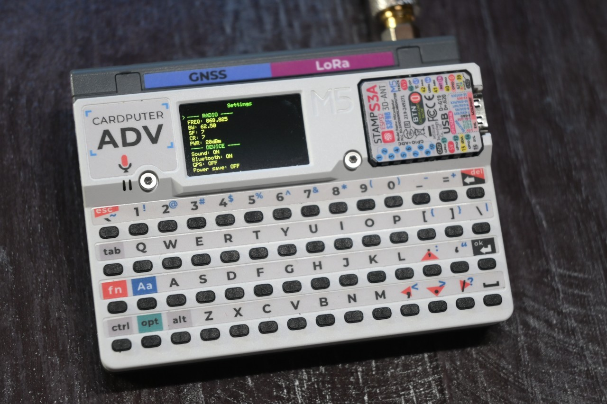
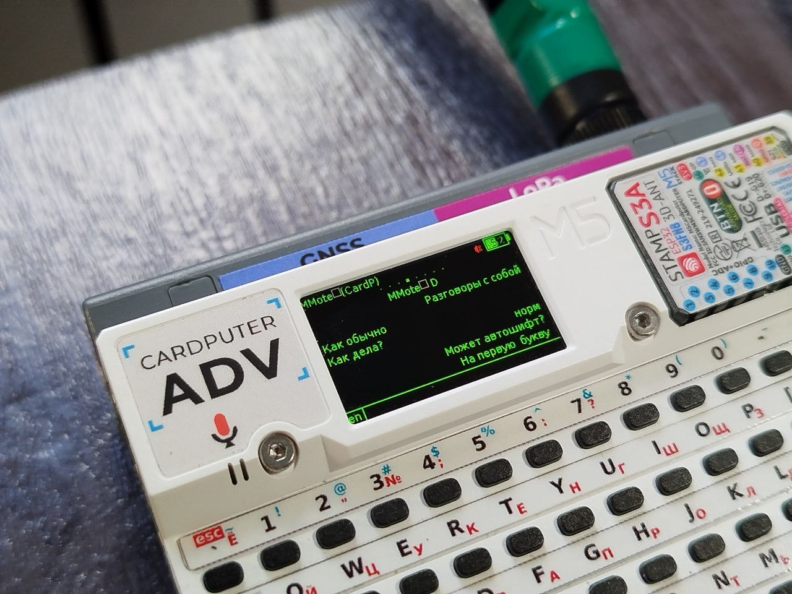
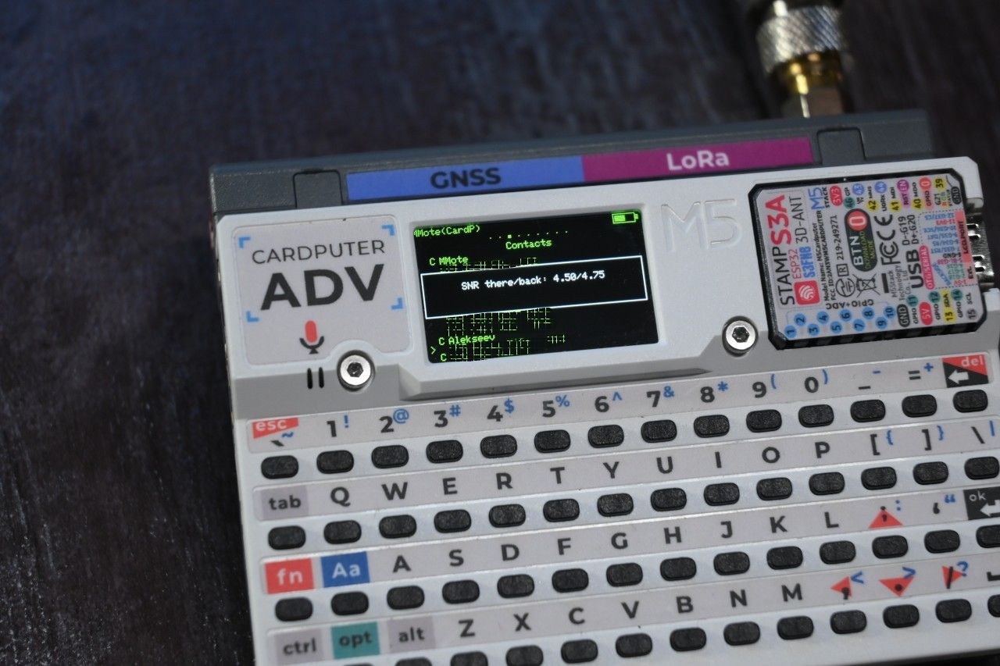

## MeshCore Cardputer-Adv + Cap LoRa-1262 variant








This variant designed to not change the original codebase. I tried to make the implementation as clean as possible.

### Building

1. Get a copy of [MeshCore](https://github.com/meshcore-dev/MeshCore). Current development is based on v1.16.0.

2. Copy the `variants/cardputer_adv` directory from this repository into the `variants` directory of the MeshCore source tree.

3. Run in the MeshCore directory:

Build:

```bash
platformio run --environment cardputer_adv_companion_radio_ble
```

Build and flash:

```bash
platformio run --target upload --environment cardputer_adv_companion_radio_ble
```

### Flashing pre-build binaries

1. Grab .bin file from [Releases](https://github.com/MultiMote/meshcore-cardputer-adv/releases) page. The "merged" firmware will not erase your settings because they are stored on the SD card.
2. Flash with https://meshcore.io/flasher or with any other ESP32S3 flaser.

### State

> [!WARNING]
> Firmware is under development. Some settings may reset after flashing a new version. Back up your data if you don't want to lose anything.

Currently implemented (companion):

- Cap LoRa-1262 initialization (+ port extender)
- G0 Button
- BLE connection
- GPS support
- GPS power management with CAS commands (Cap LoRa-1262 does not have a GPS switch pin)
- Store data to SD card
- Basic speaker support (keyboard/message beeps)
- Keyboard support
- Settings menu (press `OPT` at main screen)
- Tools menu (press `T` at main screen)
   * Advert (flood / zero hop)
   * Discover repeaters (testing)
- Light sleep (testing)
   * Power consumption drops to ~52mA after display off
   * Can be enabled in settings menu
   * Bluetooth connection is not preserved
- Battery ADC correction
- Channels list
   * Press `Enter` on channel to start conversation
- Contacts list
   * Press `Enter` on repeater/room to ping
   * Press `Enter` on contact to start conversation
- Compose and send messages
   * After sending group message, "Heard repeats" appears
- Basic display unicode support. Font is `DejaVu Sans 12` converted with `Processing 4`.

  Included unicode blocks:
   * Basic Latin (U+0000-U+007F)
   * Latin-1 Supplement (U+0080-U+00FF)
   * Cyrillic (U+0400-U+04FF)
- Keyboard layouts

   * Enabled if `/meshcore_custom/keyboard.txt` file is present on SD card
   * Switch with Ctrl+Space
   * File format (encoding is UTF-8, LF or CRLF line endings):

     ```
     layout_label (2 characters)
     key_char=replacement
     key_char=replacement
     ...rest of keys...
     ```

     Example:

     ```
     ru
     q=й
     w=ц
     e=у
     ```

   * Limits: up to 100 keys, up to 3 byte character replacement (UTF-8).
   * Available to download: [Russian](keyboard_layouts/ru/keyboard.txt)


Todo:

- Chat history
- Find a way to include MeshCore as submodule in this repository and build it from here
- Catch and display message ACK's
- Change display brightness
- Custom notification sounds (.wav files from SD card)
- Reduce power consumption (maybe replace M5Unified with more specialized libraries)
- Import contacts from SD card
- Delete contacts
- Reset path

### Thoughts on Cardputer

Due to the high power consumption of this device, I don't think it's a good choice for always-on MeshCore companion.

It draws about 130-180 mA in idle state.

I also don't quite understand the decisions made by M5Stack:

1. GPS is always on in the Cap LoRa-1262 as ON/OFF pin is connected to 3.3v. Cap LoRa-1262 has IO expander IC (PI4IOE) with 7 unused pins. Why not use them?

   

2. To enable radio, you need to set P0 of IO expander IC to high level. Without this, FM8625H remains unpowered.
   Usually radio might be damaged when antenna is not connected during transmission.

   

   

3. Cardputer has 1750mAh battery, but PROG resistor of TP4057 is 3.3k. Maximum charge current is 303mA.
   Also Cardputer charges only if power switch is on.

   

