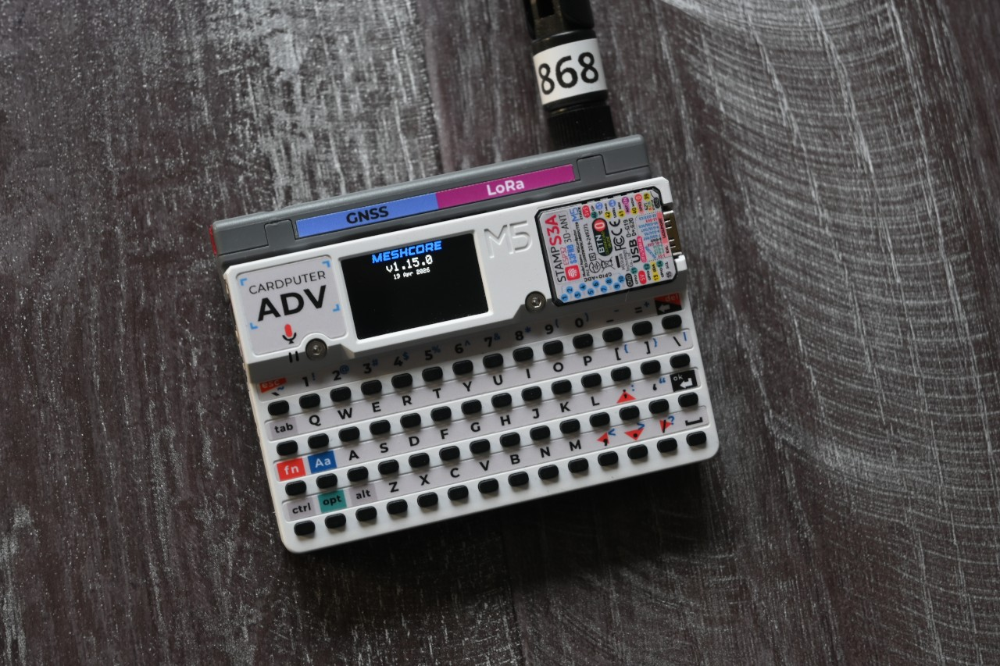
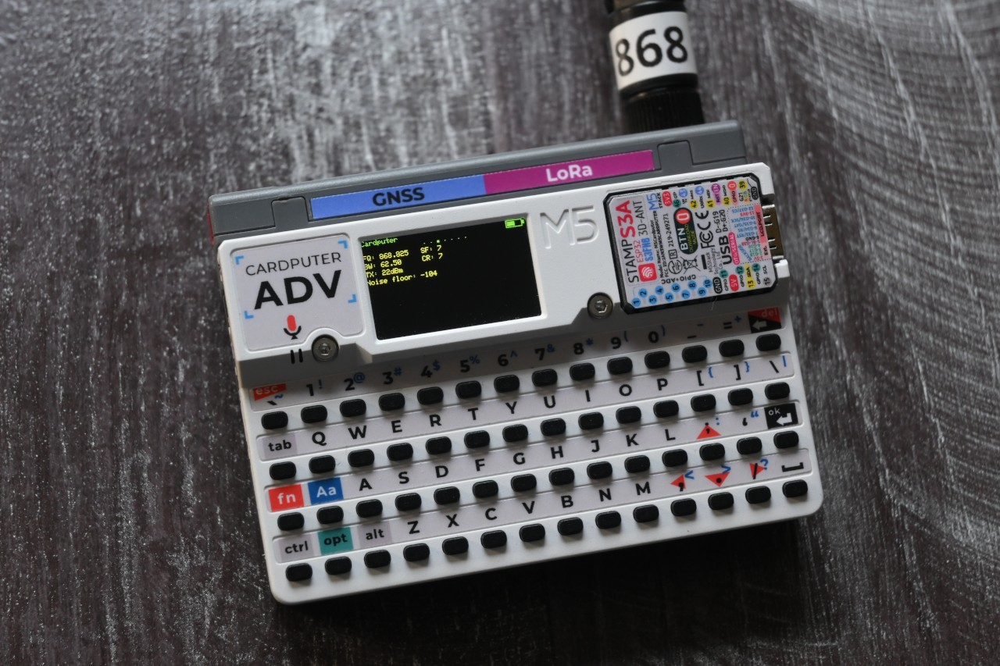
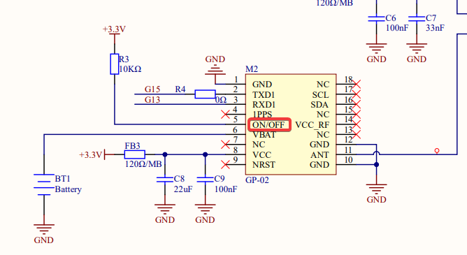
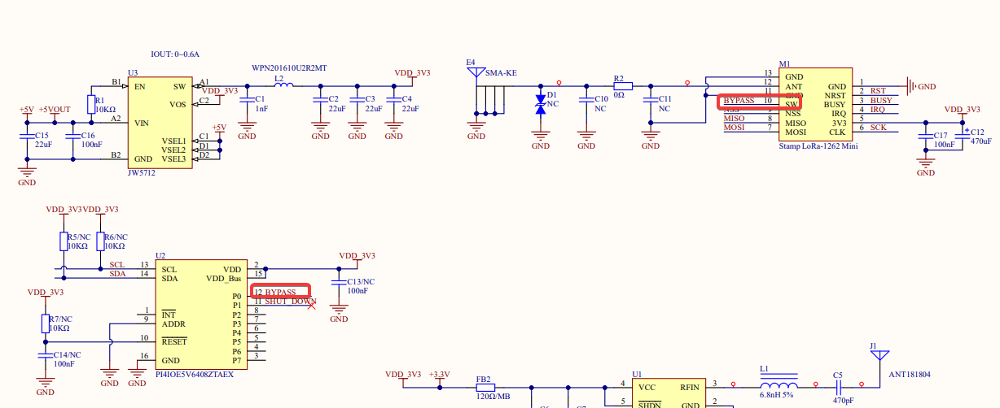
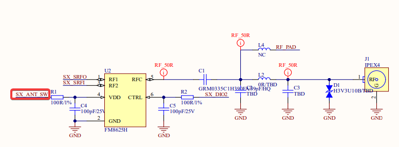
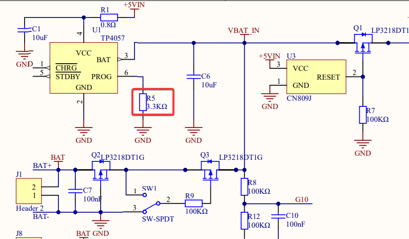

## MeshCore Cardputer-Adv + Cap LoRa-1262 variant

 



This variant designed to not change the original codebase. I tried to make the implementation as clean as possible.

### Building

1. Get a copy of [MeshCore](https://github.com/meshcore-dev/MeshCore). Current development is based on v1.15.0.

2. Copy the `variants/cardputer_adv` directory from this repository into the `variants` directory of the MeshCore source tree.

3. Run in the MeshCore directory:

Build:

```bash
platformio run --environment cardputer_adv_companion_radio_ble
```

Build and flash:

```bash
platformio run --target upload --environment cardputer_adv_companion_radio_ble
```

### State

Currently implemented (companion):

- Cap LoRa-1262 initialization (+ port extender)
- G0 Button
- Basic display
- BLE connection
- GPS support
- GPS power management with CAS commands (Cap LoRa-1262 does not have a GPS switch pin)
- Store data to SD card
- Basic speaker support (keyboard/message beeps)
- Basic keyboard support (left/right/enter)
- Light sleep (testing)
   * Power consumption drops to ~52mA after display off
   * Can be enabled enabled with `s` key
   * State is not persisted
   * Bluetooth connection is not preserved

Todo:

- More complex UI with ability to change settings, write messages
- Find a way to include MeshCore as submodule in this repository and build it from here
- GPS will turn on again after 18 hours (max standby time is 65535 seconds)

### Thoughts on Cardputer

Due to the high power consumption of this device, I don't think it's a good choice for always-on MeshCore companion.

It draws about 150-180 mA in idle state.

I also don't quite understand the decisions made by M5Stack:

1. GPS is always on in the Cap LoRa-1262 as ON/OFF pin is connected to 3.3v. Cap LoRa-1262 has IO expander IC (PI4IOE) with 7 unused pins. Why not use them?

   

2. To enable radio, you need to set P0 of IO expander IC to high level. Without this, FM8625H remains unpowered. 
   Usually radio might be damaged when antenna is not connected during transmission.

   

   

3. Cardputer has 1750mAh battery, but PROG resistor of TP4057 is 3.3k. Maximum charge current is 303mA. 
   Also Cardputer charges only if power switch is on.

   

