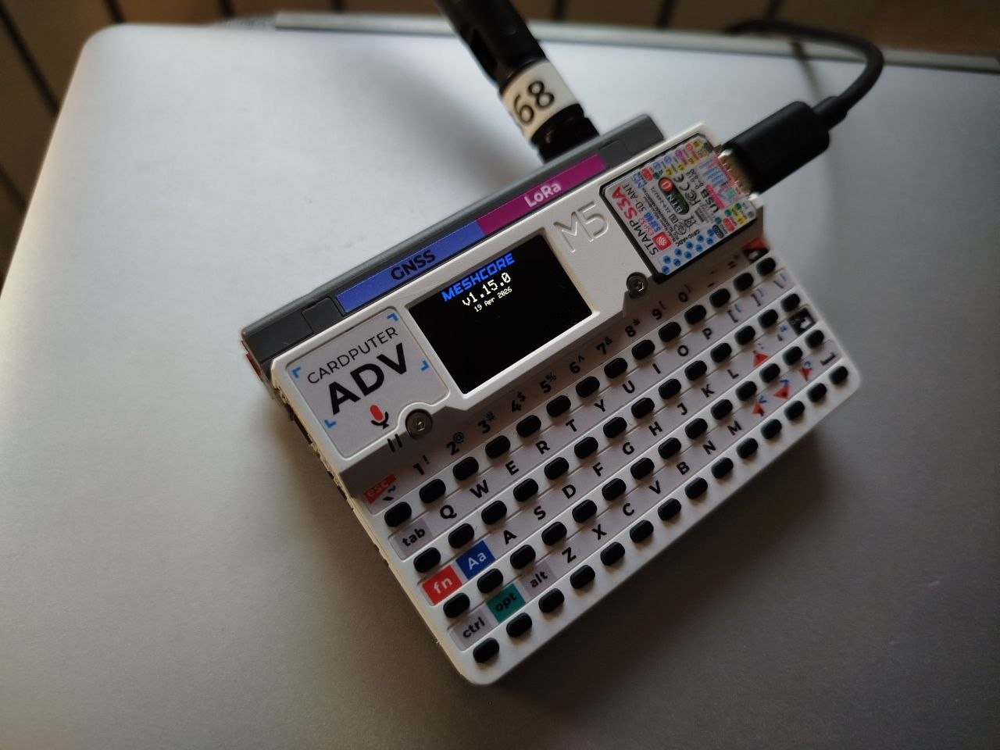

## MeshCore Cardputer ADV + Cap LoRa 1262 variant



This variant designed to not change the original codebase. I tried to make the implementation as clean as possible.

### Building

1. Get a copy of [MeshCore](https://github.com/meshcore-dev/MeshCore). Current development is based on v1.15.0.

2. Copy the `variants/cardputer_adv` directory from this repository into the `variants` directory of the MeshCore source tree.

3. Run in the MeshCore directory:

Build:

```bash
platformio run --environment cardputer_adv_companion_radio_ble
```

Build and flash:

```bash
platformio run --target upload --environment cardputer_adv_companion_radio_ble
```

### State

Currently implemented (companion):

- Cap LoRa-1262 initialization (+ port extender)
- G0 Button
- Basic display
- BLE connection
- GPS support
- GPS power management with CAS commands (Cap LoRa-1262 does not have a GPS switch pin)


Todo:

- Store data to SD card (radio stops working for some reason when using SD instead of SPIFFS)
- Keyboard support
- More complex UI with ability to change settings, write messages
- Speaker
- Find a way to include MeshCore as submodule in this repository and build it from here
